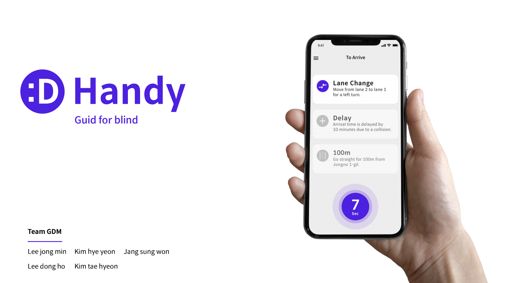
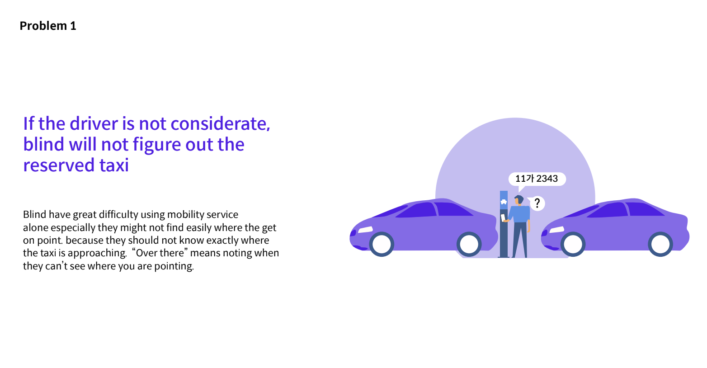
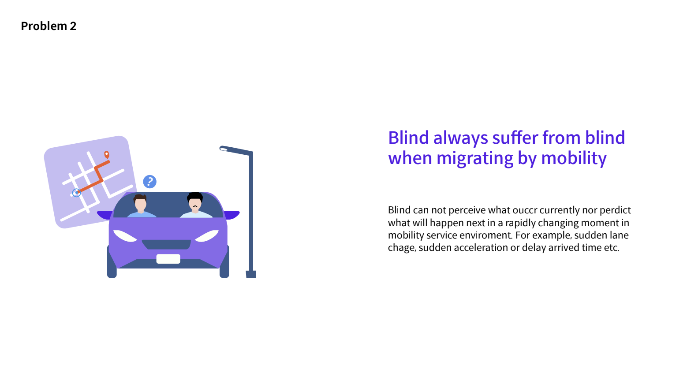
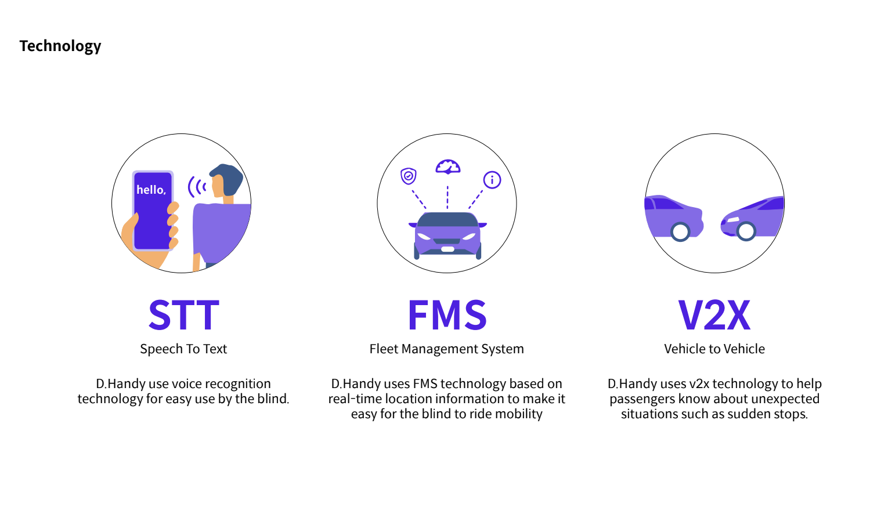
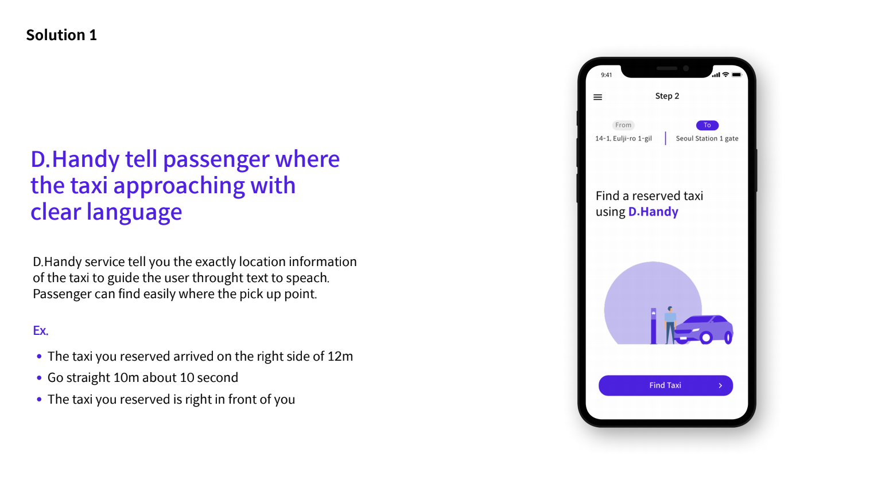
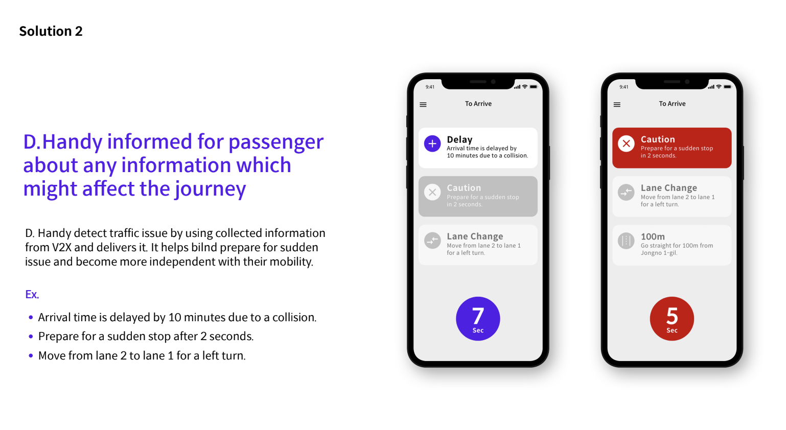
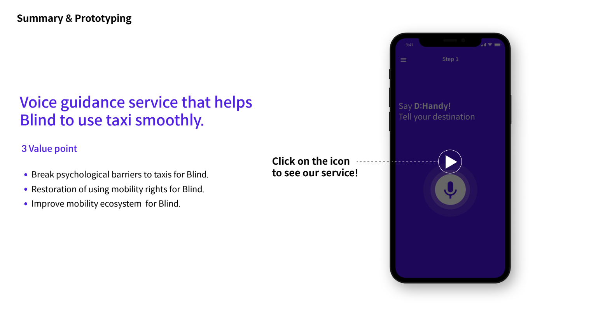

# JunctionXSeoul2021 - Android

**D.Handy**

## [ About ] 

for blind  **live messaging service in taxi**

## [ Libraries ]

- Android Material : Material Design implementation Views by Google

- Kotlin Standard Library : Kotlin graceful helper features

- AAC - ViewModel : for ViewModel

- AAC - LiveData : LiveData

- Glide : Image download, caching

- Koin : Dependency Injection

- Dexter : Permission grant helper

- Kotlin Coroutine : Asyncronized Behavior and Data retriving

- Animation - Lottie

## [ Project Architecture ]

MVVM using Koin, AAC ViewModel, Data Binding

## [Custom View + Edge Feature]

 

## [ Team ]

[이동호] ,[이종민], [김혜연], [장성원], [김태현]

## [ goddoro의 후기가 궁금하다면 ]

https://goddoro.medium.com/review-junctionx-seoul-2021-%ED%9B%84%EA%B8%B0-9ad5ea905cfb

